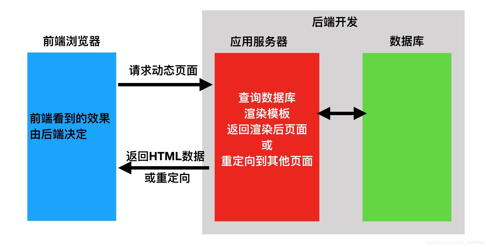
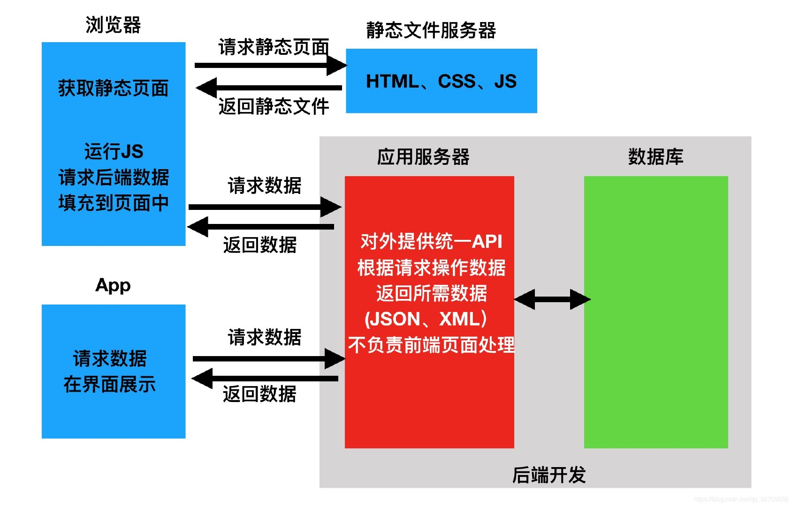

### 开发模式

在Web开发模式中，有两种开发模式

- 前后端不分离

- 前后端分离

### 前后端分离优势

在前后端不分离模式中，前端页面看到的效果都是由后端控制，由后端渲染页面或重定向，也就是后端需要控制前端的展示，前端与后端的耦合度很高。

这种应用模式比较适合纯网页应用，但是当后端对接App时，App可能并不需要后端返回一个HTML网页，而仅仅是数据本身，所以后端原本返回网页的接口不再适用于前端App应用，为了对接App后端还需再开发一套接口。

在前后端分离的应用模式中，后端仅返回前端所需的数据，不再渲染HTML页面，不再控制前端的效果。至于前端用户看到什么效果，从后端请求的数据如何加载到前端中，都由前端自己决定，网页有网页的处理方式，App有App的处理方式，但无论哪种前端，所需的数据基本相同，后端仅需开发一套逻辑对外提供数据即可。

在前后端分离的应用模式中 ，前端与后端的耦合度相对较低。

在前后端分离的应用模式中，我们通常将后端开发的每个视图都称为一个接口，或者API，前端通过访问接口来对数据进行增删改查。

### 为什么要有前后端分离

- 多端适应
- 前后端开发职责不清
  - 模板到低是前端写还是后端写?如果前端写,前端就要懂后端模板语言
  - 如果后端写,那么后端就要懂前段html,css,js甚至更多更多
- 开发效率问题,前后端相互等待
  - 前端在写的时候,就希望后端全部写好自己再写
  - 后端在写的时候,就希望前端全部写好自己再写
- 前端一直配合着后端,能力受限(搞来搞去写静态页面,天天给后台写模板)
- 后台开发语言和模板高度耦合,导致开发语言依赖(一旦用python开发,以后要换成java或者其他语言)

### **前后端分离缺点**

- 前后端学习门槛增加(比如后台很多模板语法控制前端展示,但是分离以后,需要前端自己去实现,增加前端成本,对后台来说,后端要满足规范)

- 数据依赖导致文档重要性增加

  - 文档是否详细
  - 是否及时更新
  - 修改要及时通知其他端

- 前端工作量加大

- SEO的难度增加(都是AJAX,像一些初级爬虫全部挡在外面,比如一些搜索引擎,这样你的排名就不靠前了)

  

