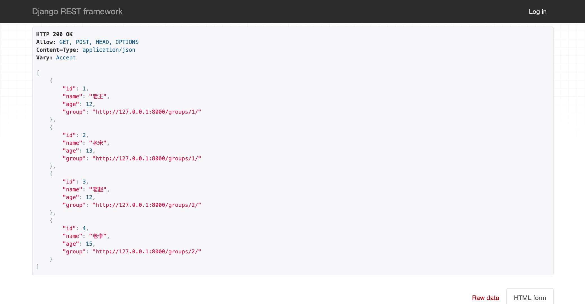

### Django REST framework

Django REST framework框架是一个用于构建Web API的强大而又灵活的工具. 通常简称为DRF框架 或 REST framework框架.

###  特点 

- 提供了定义序列化器serializer的方法,可以快速根据Django ORM或者其他库自动序列化/反序列化;
- 提供了丰富的类视图、Mixin扩展类、简化视图的编写;
- 丰富的定制层级: 函数视图、类视图、视图集合到自动生成API,满足各种需求;
- 多中身份认证和权限认证方式的支持;
- 内置了限流系统;
- 直观的API web界面;
- 可扩展性, 插件丰富

### 官方文档

```
https://www.django-rest-framework.org/
```

### 源码地址

```
https://github.com/encode/django-rest-framework/tree/master
```

### 安装

```
 pip install -i https://pypi.douban.com/simple djangorestframework==3.8.2
```


### 配置

```
INSTALLED_APPS = [
		''''''
    'rest_framework'
]
```


### 模型类

```python
class Group(models.Model):
    name = models.CharField(verbose_name='名字', max_length=100)


class Student(models.Model):
    name = models.CharField(verbose_name='名字', max_length=100)
    age = models.IntegerField(verbose_name='年龄')
    group = models.ForeignKey(to=Group, on_delete=models.CASCADE)

```


### 序列化

在应用下新建一个serializers.py文件，目的是序列化我们的模型类。

```python
from .models import Student,Group
from rest_framework import serializers


class StudentSerializer(serializers.HyperlinkedModelSerializer):
    class Meta:
        model = Student
        fields = ('id', 'name', 'age', 'group')


class GroupSerializer(serializers.HyperlinkedModelSerializer):
    class Meta:
        model = Group
        fields = ('id', 'name')

      
```

### 视图

我们对数据的增删改查全部包含在viewsets里面这个类里面了

```python
from .models import Student, Group
from rest_framework import viewsets
from .serializers import StudentSerializer, GroupSerializer


class StudentViewSet(viewsets.ModelViewSet):
    queryset = Student.objects.all()
    serializer_class = StudentSerializer


class GroupViewSet(viewsets.ModelViewSet):
    queryset = Group.objects.all()
    serializer_class = GroupSerializer

```

### 路由

通过路由器类注册视图来自动生成API的URL conf。

```python
from django.contrib import admin
from django.urls import path, include
from rest_framework import routers
from app import views

router = routers.DefaultRouter()
router.register(r'users', views.StudentViewSet)
router.register(r'groups', views.GroupViewSet)

urlpatterns = [
    path('admin/', admin.site.urls),
    path('', include(router.urls)),
    path('api-auth/', include('rest_framework.urls', namespace='rest_framework'))
]


```

### 运行

```
http://127.0.0.1:8000/
```

