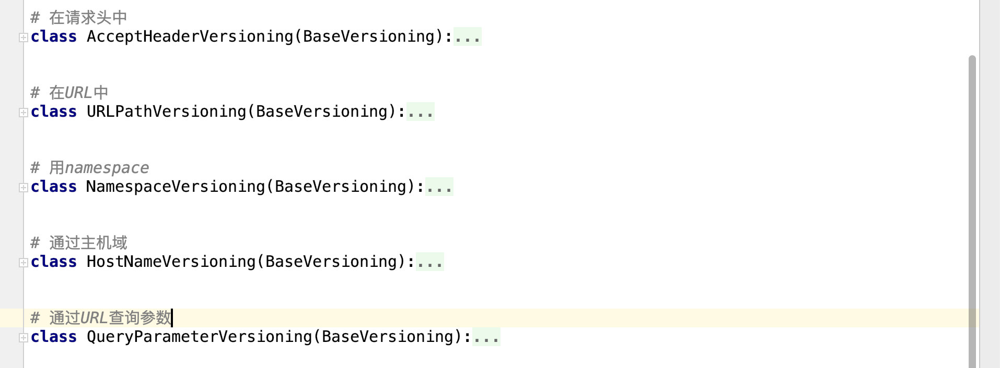

### 版本控制

API 版本控制允许我们在不同的客户端之间更改行为（同一个接口的不同版本会返回不同的数据）。 DRF提供了许多不同的版本控制方案。

可能会有一些客户端因为某些原因不再维护了，但是我们后端的接口还要不断的更新迭代，这个时候通过版本控制返回不同的内容就是一种不错的解决方案。

### 五种控制方案



### 编写视图

```python
class VersionView(APIView):

    def get(self, request, *args, **kwargs):
        # 获取版本
        print(request.version)
        # 获取版本管理的类
        print(request.versioning_scheme)
        # 反向生成URL
        reverse_url = request.versioning_scheme.reverse('app06:version-view', request=request)
        print(reverse_url)
        return Response('测试版本')

```

### 编写路由

```
path('<str:version>/version/', views.VersionView.as_view(), name='version-view'),
```

### 配置文件

```python
# 版本
    'DEFAULT_VERSIONING_CLASS': 'rest_framework.versioning.URLPathVersioning',
    'DEFAULT_VERSION': 'v1',  # 默认的版本
    'ALLOWED_VERSIONS': ['v1', 'v2'],  # 有效的版本
    'VERSION_PARAM': 'version',  # 版本的参数名与URL conf中一致
```

```
#局部配置
versioning_class = "注意不是列表"
```

