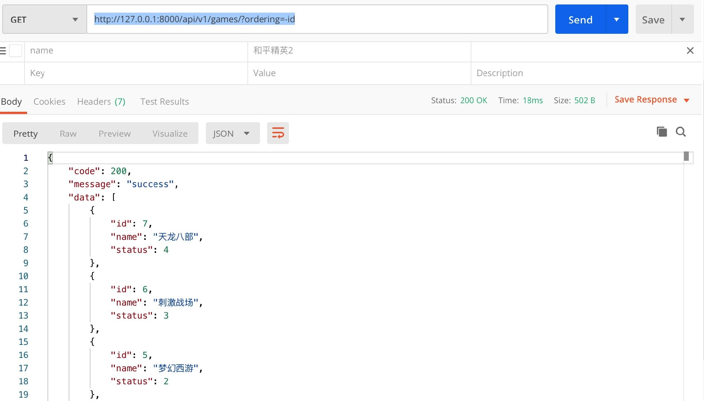
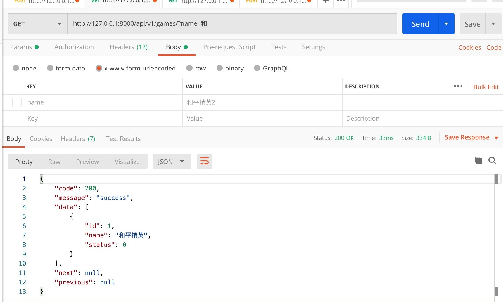
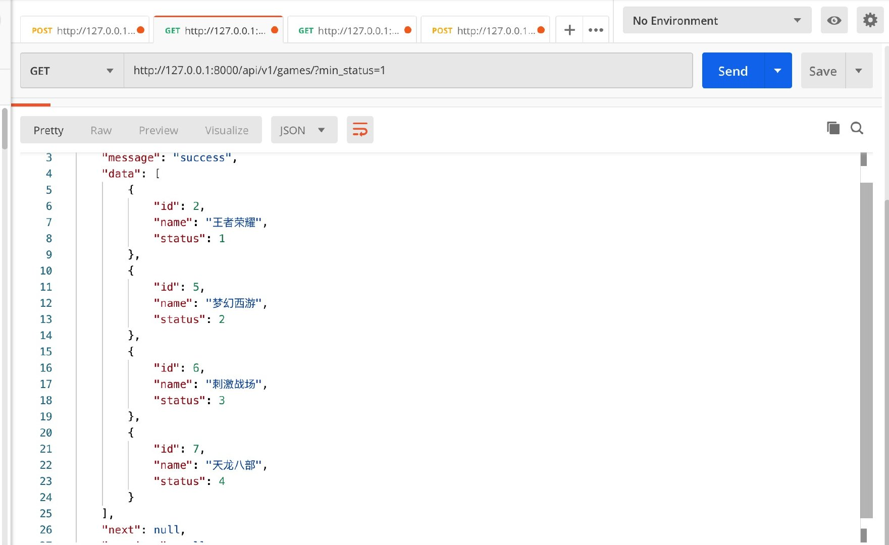
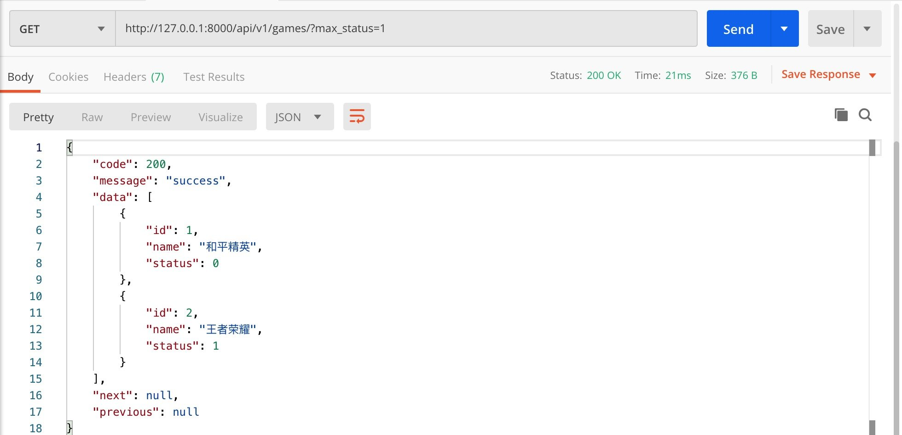
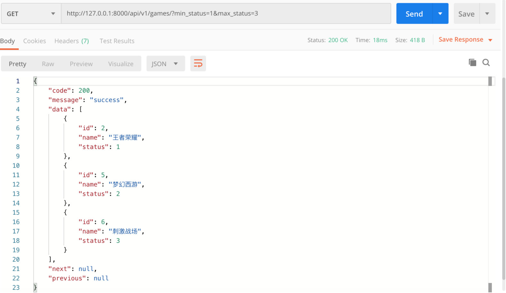

### 过滤

##### 一、利用get_queryset过滤

```python
from .custom_model_view_set import CustomModelViewSet
class GameView(CustomModelViewSet):
    queryset = Game.objects.all()
    serializer_class = GameSerializer
    
    def get_queryset(self):
        ordering = self.request.query_params.get('ordering')
        if not ordering:
            queryset = Game.objects.all()
        else:
            queryset = Game.objects.all().order_by(ordering)
        return queryset
```

```
http://127.0.0.1:8000/api/v1/games/?ordering=-id
```




##### 二、django-filter

django-filter库包括一个DjangoFilterBackend类，它支持REST框架的高度可定制的字段过滤。

- 安装

```
pip install django-filter
```

- 官网和github

```
https://django-filter.readthedocs.io/en/master/guide/rest_framework.html

https://github.com/carltongibson/django-filter
```


- 安装

```
INSTALLED_APPS = [
	""""""
	django_filters,
]
```

- 全局配置

```
  'DEFAULT_FILTER_BACKENDS': (
        'django_filters.rest_framework.DjangoFilterBackend',
        ...
    ),
```

- 视图

```python
from .custom_model_view_set import CustomModelViewSet
from rest_framework import filters
from django_filters.rest_framework import DjangoFilterBackend

class GameView(CustomModelViewSet):
    queryset = Game.objects.all()
    serializer_class = GameSerializer
    filter_backends = (DjangoFilterBackend,)
    filter_fields = ('name', 'status')

```

```
http://127.0.0.1:8000/api/v1/games/?status=1&name=和平精英
```


那我们现在搜

```
http://127.0.0.1:8000/api/v1/games/?status=1&name=和
```

发现根本搜不到


那我们就需要自定义过滤类

新建一个`custom_filter.py`文件

```
from django_filters import rest_framework as filters
from .models import Game


class GameFilter(filters.FilterSet):
    min_status = filters.NumberFilter(field_name='status', lookup_expr='gte')
    max_status = filters.NumberFilter(field_name='status', lookup_expr='lte')
    #根据名字过滤忽略大小写
    name = filters.CharFilter(field_name='name', lookup_expr='icontains')

    class Meta:
        model = Game
        fields = ('min_status', 'max_status')  # 允许精准查询的字段
        search_fields = ('name',)  # 允许模糊查询的字段

```

修改视图

```python
from .custom_model_view_set import CustomModelViewSet
from django_filters.rest_framework import DjangoFilterBackend
from .custom_filter import GameFilter

class GameView(CustomModelViewSet):
    queryset = Game.objects.all()
    serializer_class = GameSerializer

    filter_backends = (DjangoFilterBackend,)
    # filter_fields = ('name', 'status') 
    filterset_class = GameFilter

```



按最小状态搜



按最大状态搜



组合搜索



